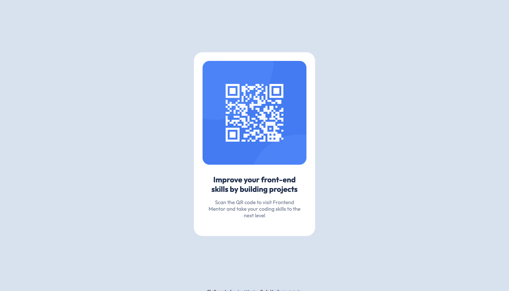

# Frontend Mentor - QR code component solution

This is a solution to the [QR code component challenge on Frontend Mentor](https://www.frontendmentor.io/challenges/qr-code-component-iux_sIO_H). I used this project more to learn how Frontend Mentor works, than to find a solution to this particular problem. Therefore the solution might not be as pretty as it could be.

## Table of contents

- [Overview](#overview)
  - [Screenshot](#screenshot)
  - [Links](#links)
- [Author](#author)

**Note: Delete this note and update the table of contents based on what sections you keep.**

## Overview

### Screenshot

### Links

- Solution URL: [Add solution URL here](https://your-solution-url.com)
- Live Site URL: [Add live site URL here](https://your-live-site-url.com)

## Author

- Website - [Benjamin Lutz](https://www.benjaminlutz.at)

**Note: Delete this note and add/remove/edit lines above based on what links you'd like to share.**
